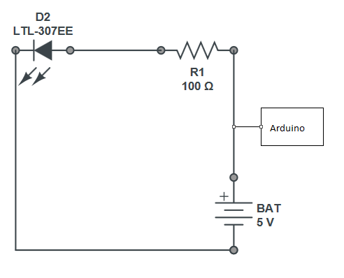
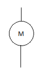

# Working with Motors

Last week it was Led’s, this week it's motors. Now you have built your first circuits, it’s time to show you how to draw these on paper to help you understand them.

# 1 – Circuit Diagrams
All electrical components including Leds and motors can be represented in a special type of drawing called a circuit diagram. We use a circuit diagram to make a map of how to build the circuit for other people to use.
If you remember the blinking led project from last week, here is the circuit diagram for that – remember, the blinking of the LED was controlled by the Arduino.
In this diagram, positive wires (+) carry volts to components and negative (-) wires carry volts away from components
 


Now let's change the circuit to add a motor that turns when the LED blinks on...
# 2 – Adding a motor
Add the motor in the diagram below, the symbol for a motor is:




# 3 – Positive and Negative Wires
Like many electrical components a motor has only two wires...positive and negative. Confusingly there are many ways to refer to the same thing and here are some of the most common. ..

Live, Positive, red, plus, all refer to the outgoing part of the circuit and this side of the circuit carries voltage into the components 

Earth, ground, black, negative, minus all refer to the incoming part of the circuit and carry voltage away from the components.

# 4 - Voltage

What is voltage? Well, for most of our circuits we make we will be using 5 volts. Think of voltage as the water moving through a pipe...without water in the pipe nothing will work. 
Now take a look at the circuit diagrams above again, they all have one thing in common. The wires are shown by a continuous line and if this line is broken, the circuit will stop working. 

A switch like those you see on your battery powered toys works this way, turning the switch off breaks the line on the circuit diagram and the circuit stops working.

# 5 – Adding a Switch to the circuit diagram
Now redraw the same circuit above and add in a switch using this symbol, where would you put the switch in the circuit so it turned the circuit off and on?
 


# Q. "Why are we drawing these diagrams all the time? I want to work with the wires..."
# A. A diagram helps you to plan out what you want to do in advance.  It helps to
1. 	Stop you from breaking components
2. 	Spot errors
3. 	Even prevent you getting an electric shock! 
4. 	Diagrams also mean that others can follow your work and copy it.
6.  Adding a switch to your circuit
Now try to follow your diagram you made and add a switch to your circuit you are building - What happens when you connect the switch in different places on the circuit?
Now we have a switch working, let's now add the motor to the circuit.  If we had added the motor before the switch, we could have never turned it off! 
7.  Adding a motor to the circuit
At this point your circuit will work and the motor will be able to be switched off and on by you at the switch
8.  Turning the motor round
Now, we already know from last week that the led only works one way so what about the motor?
Try connecting the positive and negative wires the other way round on the motor what happens to the way it moves? Why do you think this is?

Now we have built a circuit with a motor and a switch in, next week we will look at the making the circuit allow us to use and control two motors together. These motors will become the wheels of our robot. 
Using the Arduino we will help you connect the circuit and show you how to reverse each wheel. This will help steer the robot.
See you next week. 


```
void setup() {
  
  //Setup Channel A
  pinMode(10, OUTPUT); //Initiates Motor Channel A pin
  pinMode(14, OUTPUT); //Initiates Brake Channel A pin
  
}

void loop(){
  
  //forward @ full speed
  digitalWrite(10, HIGH); //Establishes forward direction of Channel A
  digitalWrite(14, LOW);   //Disengage the Brake for Channel A
  analogWrite(3, 255);   //Spins the motor on Channel A at full speed
  
  delay(3000);
  
  digitalWrite(14, HIGH); //Eengage the Brake for Channel A

  delay(1000);
  
  //backward @ half speed
  digitalWrite(10, LOW); //Establishes backward direction of Channel A
  digitalWrite(14, LOW);   //Disengage the Brake for Channel A
  analogWrite(3, 123);   //Spins the motor on Channel A at half speed
  
  delay(3000);
  
  digitalWrite(14, HIGH); //Eengage the Brake for Channel A
  
  delay(1000);
  
}
```
